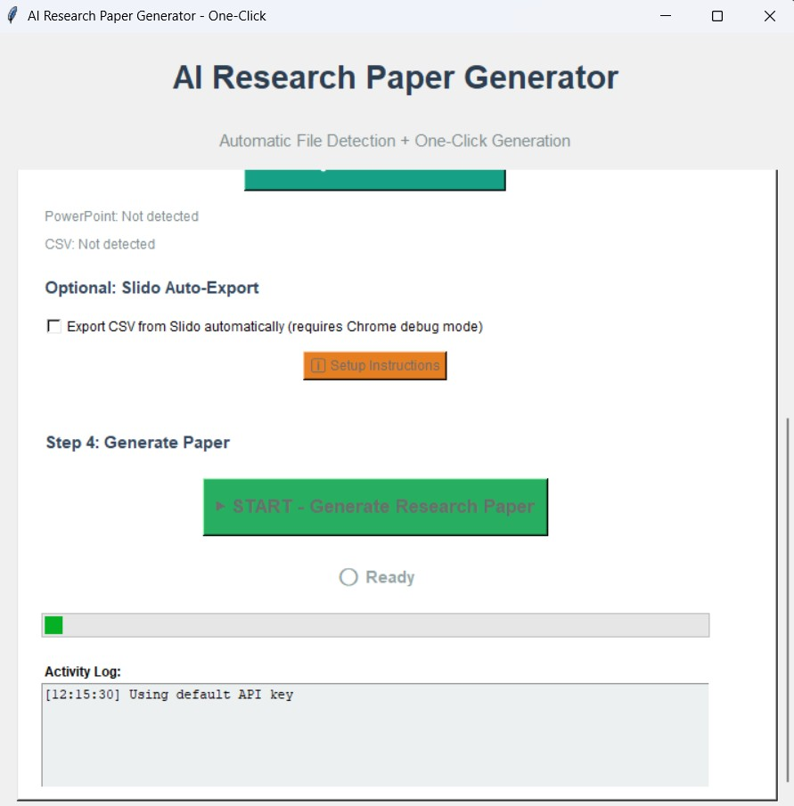
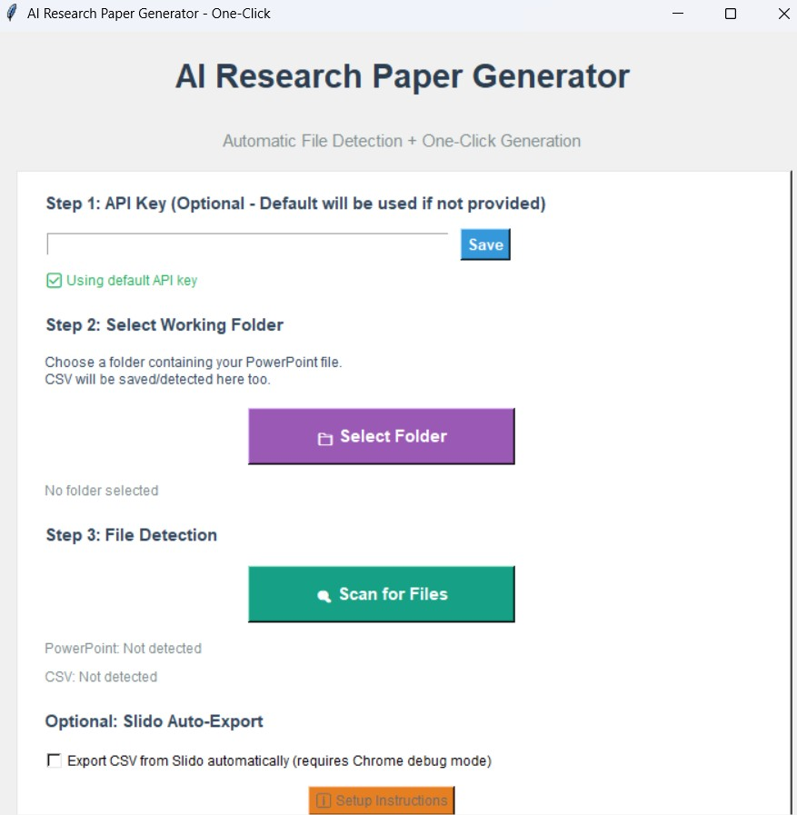

# 📄 AI Research Paper Generator

### *One-Click Academic Paper Generation from Presentations & Survey Data*

[](https://python.org)
[](https://anthropic.com)
[](https://python.org)
[](https://pandas.pydata.org)
[](https://matplotlib.org)

> ⚠️ **Proprietary Software Notice:** This codebase is the exclusive intellectual property of the client. It is not open source and may not be copied, distributed, modified, or reused without explicit written permission from the owner.

---

*Point the app at a folder. Press one button. Get a fully formatted, citation-rich, publication-ready Word document — complete with charts, figures, and Vancouver-style references — in under 5 minutes.*

---

## ✨ What Makes This Special?

Writing academic papers from conference presentations and audience poll data is a time-consuming process that typically takes hours of manual work. This tool **fully automates that workflow** — extracting slide content, analysing survey responses, generating professional data visualizations, and prompting Claude Sonnet 4 to write a structured, scholarly paper with proper citations and figure placement.

> **"From a PowerPoint and a CSV export to a fully formatted, publication-ready Word document in one click."**

---

## 🖥️ Application Walkthrough

### The Interface — Steps 1 to 4

The application opens as a clean, scrollable desktop window with four clearly labelled steps:



> **Step 1** — Optionally enter your own Anthropic API key, or use the built-in default. **Step 2** — Select the working folder containing your PowerPoint. **Step 3** — Scan for files automatically. The app finds the most recent `.pptx`, `.pdf`, `.csv`, or `.xlsx` in the folder without any manual selection.

---

### Step 4 — Generate & Monitor

Once files are detected, one click starts the full pipeline. A real-time Activity Log shows exactly what is happening at each stage:



> The progress bar and timestamped log keep you informed throughout the 2–5 minute generation process. When complete, the output folder opens automatically with your `.docx` ready to use.

---

## 🚀 Feature Overview

| Feature | Details |
|---|---|
| 📂 **Auto File Detection** | Finds the most recent `.pptx`, `.pdf`, `.csv`, `.xlsx`, or `.xls` automatically |
| 🤖 **AI Paper Generation** | Claude Sonnet 4 writes a full 2500–3000 word academic paper |
| 📊 **Auto Visualizations** | Generates 2–6 charts (pie, bar, line, box plot, stacked bar) at 300 DPI |
| 🔗 **Reference Extraction** | Extracts URLs, DOIs, and citations directly from presentation slides |
| 📋 **Vancouver Citations** | Enforces numbered academic citation style with DOIs/URLs throughout |
| ✅ **Two-Pass Validation** | A second AI pass checks and corrects formatting before saving |
| 📄 **Word Document Output** | Professionally formatted `.docx` with embedded figures, headings, and Table 1 |
| ⚡ **Fast Startup** | Heavy libraries load lazily — only when needed |
| 🔄 **Excel Support** | Automatically converts `.xlsx` / `.xls` survey exports to CSV |

---

## 🧠 Pipeline Architecture

```
+-------------------------------------------+
|        Working Folder (user selects)       |
|  presentation.pptx  +  survey_data.csv     |
+--------------------+----------------------+
                     |
                     v
     +---------------+---------------+
     |         File Processing        |
     |  Extract text, URLs, DOIs,     |
     |  citations from slides/PDF     |
     +---------------+---------------+
                     |
                     v
     +---------------+---------------+
     |        Survey Analysis         |
     |  Value counts, percentages,    |
     |  response rates per question   |
     +---------------+---------------+
                     |
                     v
     +---------------+---------------+
     |      Data Visualizations       |
     |  Pie · Bar · Stacked Bar       |
     |  Line · Box Plot · H-Bar       |
     |  Saved as 300 DPI PNG          |
     +---------------+---------------+
                     |
                     v
     +---------------+---------------+
     |      Claude API — Pass 1       |
     |  Full academic paper generated |
     |  2500–3000 words               |
     |  Vancouver citations           |
     |  Inline figure references      |
     +---------------+---------------+
                     |
                     v
     +---------------+---------------+
     |      Claude API — Pass 2       |
     |  Validate formatting rules     |
     |  Correct numbered lists,       |
     |  figure markers, citations     |
     +---------------+---------------+
                     |
                     v
     +---------------+---------------+
     |     Word Document (.docx)      |
     |  Headings · Arial font         |
     |  Embedded charts + captions    |
     |  Table 1 · References list     |
     +-------+-----------------------+
             |
             v
   Research_Paper_YYYYMMDD_HHMMSS.docx
```

---

## 📄 Output Document Structure

Every generated paper follows a consistent academic structure:

```
Title
Abstract (with bolded Keywords label)
─────────────────────────────────────
Introduction
Literature Review        ← Vancouver citations [1], [2]...
Methodology
Results                  ← Inline figures + survey stats
Discussion
Conclusion
─────────────────────────────────────
Table 1: Summary Statistics
References               ← Numbered with DOIs/URLs
Visualizations           ← Any remaining figures
```

**Formatting applied throughout:**
- Font: Arial, 11pt body / 14pt H1 / 12pt H2
- Line spacing: 1.15 with 6pt paragraph spacing
- Figures: centred, 5.5 inches wide, italic caption
- Keywords label in abstract: bold

---

## 📊 Visualizations Generated

The app automatically selects chart types based on the survey data available:

| Chart Type | When Created |
|---|---|
| 🥧 Pie chart | Categorical columns with 2–10 unique values |
| 📊 Vertical bar chart | Categorical columns with 2+ values |
| 📊 Stacked bar chart | When multiple categorical columns are available |
| 📈 Line graph | Categorical columns with 3+ ordered values |
| 📦 Box plot | Numerical columns with 5+ data points |
| ↔️ Horizontal bar chart | Additional categorical columns |

All charts are saved as **300 DPI PNG** files and embedded directly into the Word document at the correct positions.

---

## ⚡ Quick Start

### Requirements

```bash
pip install anthropic python-docx matplotlib seaborn pandas \
            openpyxl python-pptx PyPDF2
```

| Package | Purpose |
|---|---|
| `anthropic` | Claude Sonnet 4 API calls |
| `python-docx` | Word document creation |
| `matplotlib` + `seaborn` | Chart generation |
| `pandas` + `openpyxl` | CSV/Excel reading |
| `python-pptx` | PowerPoint text extraction |
| `PyPDF2` | PDF text extraction |

### Run the App

```bash
python application.py
```

---

## 🗂️ How to Use

**1. API Key (Step 1)**
Leave blank to use the default key, or enter your own Anthropic API key and click **Save**.

**2. Select Folder (Step 2)**
Click **Select Folder** and choose the directory containing your PowerPoint presentation. Place your CSV survey export in the same folder.

**3. Scan for Files (Step 3)**
Click **Scan for Files**. The app will automatically detect the most recently modified presentation and survey file. Excel files are converted to CSV automatically if no CSV is present.

**4. Generate (Step 4)**
Click **START — Generate Research Paper**. Monitor progress in the Activity Log. When complete, the folder opens automatically with your `.docx` ready.

---

## 📁 Project Structure

```
project/
│
├── application.py              # Full application (single file)
│
└── working_folder/             # Your folder with input files
    ├── presentation.pptx       # Input: presentation slides
    ├── survey_data.csv         # Input: poll/survey export
    ├── figure_1_pie_*.png      # Auto-generated chart
    ├── figure_2_bar_*.png      # Auto-generated chart
    │   ...
    └── Research_Paper_YYYYMMDD_HHMMSS.docx   # Output
```

---

## ⚙️ Configuration

| Setting | Default | Description |
|---|---|---|
| Paper length | 2500–3000 words | Target word count for generated paper |
| Min visualizations | 2 | Minimum charts guaranteed |
| Max visualizations | 4–6 | Maximum charts created |
| Chart resolution | 300 DPI | Output quality for PNG charts |
| Figure width | 5.5 inches | Width of embedded figures in Word |
| Citation style | Vancouver | Numbered refs with DOIs/URLs |
| Reference recency | 2020–2025 | Preferred publication date range |

---

## ⚠️ Important Notes

- **Survey Data:** The CSV should come from your audience poll export (e.g. Slido manual export, Google Forms, or similar). The app analyses individual response data — not aggregated totals — for richer statistical reporting.
- **Slido Export:** Slido does not provide a public API for automated data access. Survey data must be **manually exported** from Slido as a CSV or Excel file and placed in the working folder before scanning. The app will detect and process it automatically from there.
- **Presentation Quality:** The richer your slide content, the better the paper. Image-heavy slides with minimal text will provide less context for the AI to work with.
- **First Run:** Startup is fast due to lazy loading. The first generation call may take a moment as libraries initialise.
- **Windows:** The app automatically opens the output folder in Windows Explorer on completion. On macOS/Linux this step is skipped.

---

## 🔒 Proprietary Notice

> This software was developed as a **commissioned project** and is the **exclusive intellectual property of the client**. The source code, logic, prompts, and associated assets are **confidential and proprietary**.
>
> - ❌ This code may **not** be copied, redistributed, or published
> - ❌ This code may **not** be used in other projects without written permission
> - ❌ This code may **not** be reverse engineered or repurposed
>
> All rights reserved. Unauthorised use is strictly prohibited.
